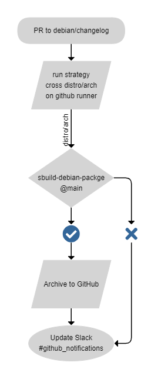

# Release process

This document covers the release procedures for core WLAN Pi team members. For general contribution guidelines and detailed Git workflow, see [Contributing](CONTRIBUTING.md).

> **For Git workflow details**: Branching strategy, merge strategies, and troubleshooting common scenarios are covered in [Contributing](CONTRIBUTING.md).

## Overview

Releases are managed through Git tags and GitHub workflows. The `main` branch represents the current stable release, while `dev` contains the next release's changes.

## Branch strategy (Quick Reference)

General branching strategy. May vary per repo.

| Branch | Purpose |
|--------|---------|
| `main` | Production/stable releases only |
| `dev` | Integration branch for next release |
| `u/<user>/<desc>` | Personal development branches |
| `feature/<desc>` | Shared long-term feature work |
| `bugfix/<desc>` | Bug fix branches |

### Branch rules

- **No direct commits to `main`** - All changes come via PRs from `dev`
- **No direct commits to `dev`** - All changes come via PRs from feature branches

**See [Contributing](CONTRIBUTING.md) for detailed workflow**, including:
- Feature branch workflow and keeping branches in sync
- Critical merge strategies (squash vs regular merge)
- Version collision handling
- Branch divergence recovery

## Creating a release

### 1. Prepare the release

Ensure `dev` is stable and all intended changes are merged:

```bash
git checkout dev
git pull origin dev
```

### 2. Update version and changelog

Update `debian/changelog` with the new version:

```bash
dch -v <version> "Release version <version>"
```

Example:
```bash
dch -v 1.2.3 "Release version 1.2.3"
```

Commit this change:
```bash
git add debian/changelog
git commit -m "Bump version to 1.2.3"
```

### 3. Create and push tag

Create an annotated tag with the version:

```bash
git tag -a v1.2.3 -m "Release version 1.2.3"
git push origin v1.2.3
```

**Important:** Tend to always use annotated tags (`-a`) not lightweight tags.

### 4. Merge to main

Create a PR from `dev` to `main` and merge using **"Create a merge commit"** (not squash) to preserve the release history.

See [Contributing](CONTRIBUTING.md) for why regular merges between `dev` and `main` are required.

### 5. Deploy to Packagecloud

The tag push triggers the deployment workflow:

1. Package is built automatically
2. Uploaded to [wlanpi/dev](https://packagecloud.io/wlanpi/dev)
3. Test the package
4. Once verified, promote from `dev` to `main` in Packagecloud

## GitHub workflows

### Build and archive

Triggered by: Changes to `debian/changelog` in PRs

Purpose: Build packages for testing without deploying

Use this to verify builds work before tagging.

### Deploy to Packagecloud

Triggered by: Typically either pushing a version tag (`v*.*.*`) or an edit to `debian/changelog`

Purpose: Builds and deploy to Packagecloud dev repository

Maintained by:

- Build logic: [sbuild-debian-package](https://github.com/wlan-pi/sbuild-debian-package)
- Workflow files

Promotion from dev to main: Manually done on Packagecloud.

### Workflow diagrams

**Build and Archive:**



**Deploy to Packagecloud:**


## Merging Pull Requests

### For contributors

When merging external contributions, use **"Squash and merge"** by default:

1. Review the commit messages in the PR
2. Clean up any "fix typo", "address feedback" commits
3. Ensure the final commit message is descriptive
4. Click "Squash and merge"

This keeps the git history clean and readable.

### When NOT to squash

Use "Create a merge commit" when:
- The PR contains logically separate commits that should be preserved
- It's a release PR from `dev` to `main`
- The contributor specifically requests commits be preserved (and there's good reason)

See [Contributing](CONTRIBUTING.md) for detailed merge strategy guidance.

## Troubleshooting

### Tag already exists

If you need to replace a tag (only before pushing):

```bash
git tag -d v1.2.3
git push origin :refs/tags/v1.2.3
git tag -a v1.2.3 -m "Release version 1.2.3"
git push origin v1.2.3
```

### Build failures

Check the GitHub Actions logs for:
- Missing dependencies in `debian/control`
- Syntax errors in `debian/rules`
- Missing files in `debian/install`

### Packagecloud issues

Contact Josh Schmelzle for Packagecloud issues.

## See also

- [Contributing](CONTRIBUTING.md) - General contribution guidelines and detailed Git workflow
- [Packaging Example](PACKAGING_EXAMPLE.md) - Packaging walkthrough
- [Architecture/Packaging](architecture/PACKAGING.md) - Detailed packaging standards
