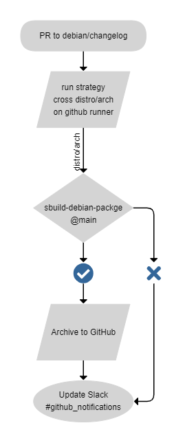
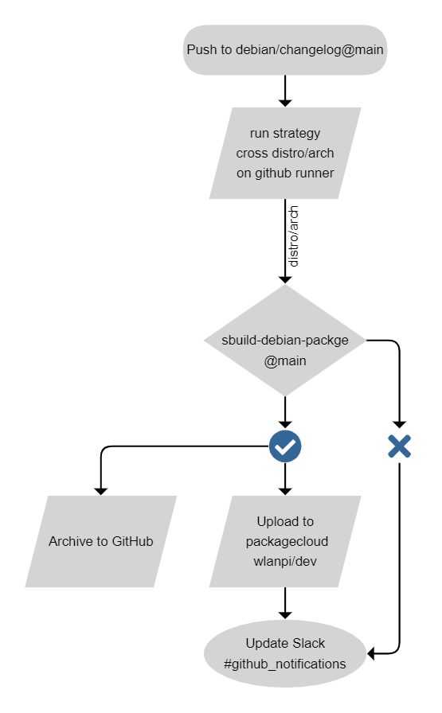

# GitHub Workflows

## Packaging and deployment

There are two primary workflows around packaging and deployment.

They are similar with slight differences.

The core of the logic for each is in [sbuild-debian-package](github.com/wlan-pi/sbuild-debian-package) maintained by [Daniel Finimundi](https://github.com/danielmundi).

### Build and Archive Debian Package

This workflow is triggered by a pull request (PR) on the `debian/changelog` file. Once completed, an archive of the Debian package will be uploaded to GitHub.

The purpose of this workflow is to have a mechanism to build Debian packages for development and testing without deploying to our package archive hosted by Packagecloud. This is also helpful for troubleshooting application build problems prior to deployment.

Here is a flowchart showing the process for the GitHub workflow:

### Deploy to Packagecloud

The purpose of this workflow is to build and deploy Debian packages to the WLAN Pi package archive. By default, it will upload to a development staging area on Packagecloud at [wlanpi/dev](https://packagecloud.io/wlanpi/dev).

Once packages are uploaded to `wlanpi/dev` they can be tested by developers and/or brave souls participating as beta testers. To add `wlanpi/dev` to your compatible WLAN Pi, follow the `deb` [instructions from packagecloud](https://packagecloud.io/wlanpi/dev/install).

The core team is responsible for "promoting" packages from `wlanpi/dev` to `wlanpi/main` once they are determined to be stable.

Here is a flowchart showing the process for the GitHub workflow:

