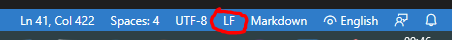
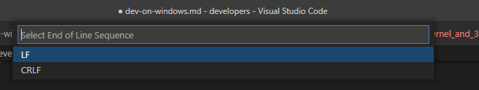

# Development on Windows (VSC/Git)

Although development on Windows is fine for the WLAN Pi, there are a few areas to consider due to the differences between Windows (your dev machine) and Linux (the target OS used by the WLAN Pi)

## Line endings

When using Visual Studio Code (VSC) with Git on Windows, files that are edited will use a `CR` + `LF` for line endings in text files (this includes shell scripts, config files & Python files). This will cause issues when running Python and shell scripts on the Linux OS used by the WLAN Pi. Also, configuration files may also have `CR` + `LF` endings added, which causes issues when they are read by a Linux based script or program.

Linux uses line endings that are a single `LF` by default. When editing files destined for Linux system using VSC & Git on Windows, we need to ensure that we configure Git to use only `LF` line endings for the WLAN Pi project we are working on.

The best approach is to force the use of `LF` line endings via the git environment configuration parameters. The parameters to be used are shown below. Note that they may be configured on a per-project basis (local parameters), or globally for all projects (global parameters). There is no need for any program restarts once these changes are made, they become effective immediately.

```
# global parameters to force all projects to use LF line endings

# list current settings
git confg --global -l

# set line endings
git config --global core.autocrlf "false"
git config --global core.eol "lf"

# list new settings
git confg --global -l
```

```
# local parameters to force a specific project to use LF line endings

# list current settings
git confg --global -l

# set line endings
cd <project dir>
git config --local core.autocrlf "false"
git config --local core.eol "lf"

# list new settings
git confg --global -l
```

## Checking line endings

The quick and easy way to check the line endings used in a file you are working on is to look at the status bar at the bottom right of the VSC UI. `LF` indicates the file is using only `LF` characters. `CRLF` indicates that the ile is using `CR` + `LF` characters (which is a bad thing). To change the line endings used, simply click the `CRLF` text and change it to `LF` using the drop-down provided at the top of the UI.





## References

 - https://www.git-scm.com/book/en/v2/Customizing-Git-Git-Configuration
 - https://git-scm.com/docs/git-config
